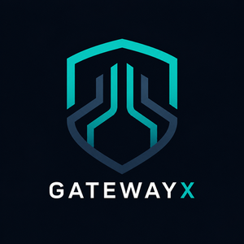
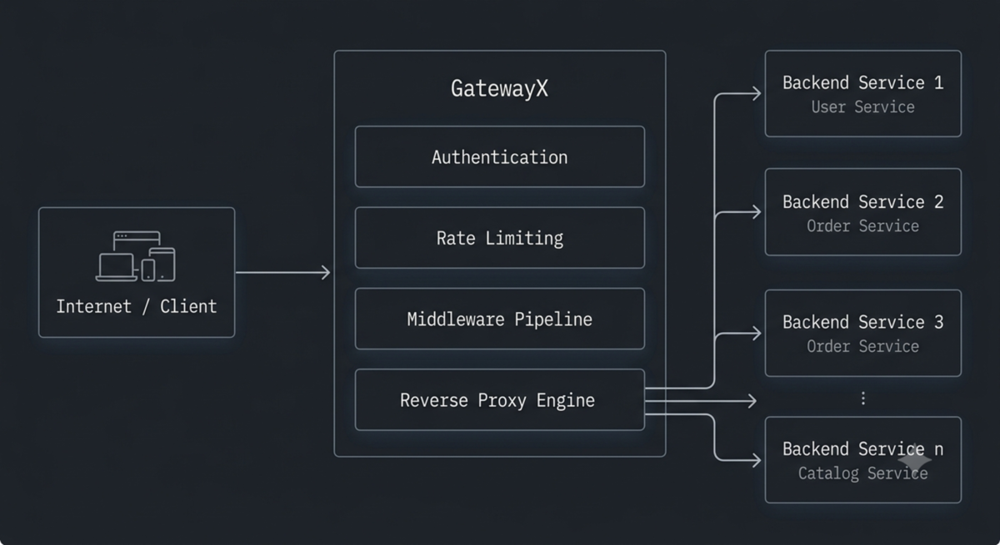
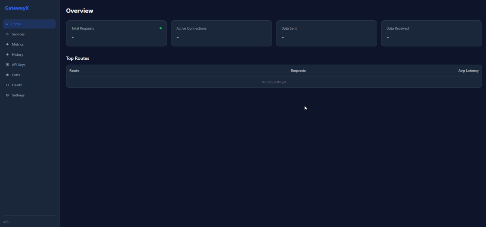
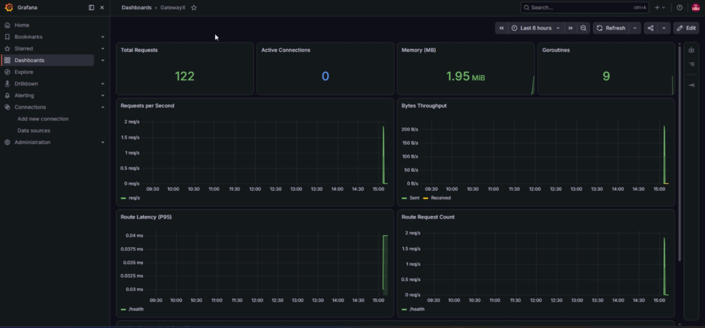
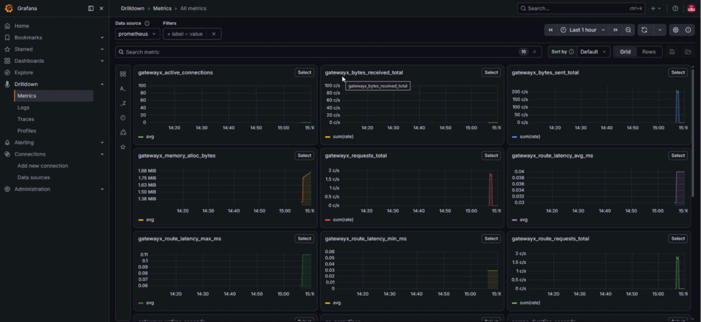
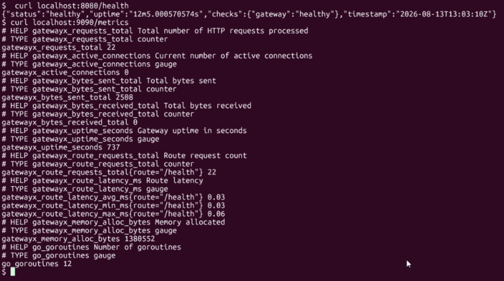

<p align="center">
  
</p>

<h1 align="center">GatewayX</h1>
<p align="center"><strong>Developer Infrastructure Platform</strong></p>
<p align="center"><sub>by <a href="https://github.com/oni1997">Onesmus Maenzanise</a></sub></p>

<p align="center">
  <a href="https://github.com/oni1997/gatewayx/actions/workflows/ci.yml"></a>
  <a href="https://codecov.io/gh/oni1997/gatewayx"></a>
  <a href="https://github.com/oni1997/gatewayx/pkgs/container/gatewayx"></a>
  <a href="https://github.com/oni1997/gatewayx/blob/main/LICENSE"></a>
  <a href="https://go.dev"></a>
  <a href="https://oni1997.github.io/gatewayx/"></a>
</p>

<p align="center">
  
</p>

---

GatewayX is a high-performance, extensible API gateway built in Go. It serves as the foundation for a suite of developer infrastructure tools -- think Traefik and Kong, but built around the developer experience first.

## Screenshots

### Dashboard

<p align="center">
  
</p>

### Grafana Dashboards

<p align="center">
  
</p>

<p align="center">
  
</p>

### Terminal

<p align="center">
  
</p>

## Features

- **Reverse Proxy** -- HTTP/HTTPS forwarding with load balancing
- **Host & Path Routing** -- Route traffic by hostname and URL path
- **Load Balancing** -- Round-robin, weighted, and health-aware (backend draining)
- **Authentication** -- JWT (HS256/RS256/ES256), API keys, Basic Auth, HMAC, OAuth 2.0 (GitHub/Google), mTLS
- **RBAC** -- Role-based access control with path glob matching
- **Session Management** -- In-memory TTL sessions with cookie/header support
- **Rate Limiting** -- Token bucket and sliding window, per-IP, per-user, per-key
- **Response Caching** -- In-memory TTL cache with `X-Cache` headers
- **WebSocket Support** -- Proxies `Upgrade: websocket` connections
- **Circuit Breaker** -- Auto-open on repeated failures, half-open probe recovery
- **Health Checks** -- Active upstream monitoring with automatic backend draining
- **Hot Reload** -- Edit config, auto-reloads via file watching (or SIGHUP)
- **Persistence** -- SQLite backend for API keys and certificates (survives restart)
- **TLS Support** -- HTTPS with certificate file or auto-cert (Let's Encrypt)
- **Metrics** -- Prometheus-format metrics endpoint
- **ML Analysis** -- Attack detection, bottleneck finder, rate limit recommendations (no LLM)
- **Structured Logging** -- JSON or text logging via slog with configurable levels
- **Webhook Alerts** -- Slack/Discord alerts for threats, rate limit spikes, backend failures
- **Configuration File** -- YAML-based declarative configuration with env var overrides
- **CLI Tool** -- `init` (interactive config), `serve`, `validate` (Cobra)
- **Docker Ready** -- Multi-stage Dockerfile with gateway + CLI + dashboard
- **Token Caching** -- In-memory JWT cache to reduce validation overhead
- **Extensible** -- Plugin system with lifecycle hooks

## Quick Start

```bash
git clone https://github.com/oni1997/gatewayx.git
cd gatewayx

go build -o bin/gatewayx ./apps/gateway
go build -o bin/gatewayx-cli ./apps/cli

cp gatewayx.example.yaml gatewayx.yaml

./bin/gatewayx
```

## Deploy with Docker / Podman

Pull the pre-built image from GitHub Container Registry and run with a single command:

```bash
# Podman
podman pull ghcr.io/oni1997/gatewayx:latest
podman run -d -p 8080:8080 -p 9090:9090 \
  -v $(pwd)/gatewayx.yaml:/etc/gatewayx/gatewayx.yaml \
  ghcr.io/oni1997/gatewayx:latest

# Docker
docker pull ghcr.io/oni1997/gatewayx:latest
docker run -d -p 8080:8080 -p 9090:9090 \
  -v $(pwd)/gatewayx.yaml:/etc/gatewayx/gatewayx.yaml \
  ghcr.io/oni1997/gatewayx:latest
```

Then visit:
- `http://localhost:8080/health` — health check
- `http://localhost:9090/metrics` — Prometheus metrics
- `http://localhost:9090/` — Dashboard

## Example Config

```yaml
server:
  host: "0.0.0.0"
  port: 8080

oauth:
  provider: "github"
  client_id: "${GITHUB_CLIENT_ID}"
  client_secret: "${GITHUB_CLIENT_SECRET}"
  redirect_url: "http://localhost:9090/oauth/callback"

routes:
  - name: "public-api"
    listen_path: "/api"
    upstream_urls: ["http://backend-1:3000", "http://backend-2:3000"]
    rate_limit:
      rate: 100
      burst: 200
      per_ip: true
    cache:
      ttl: 30s
    compression: true
    health_check:
      path: "/health"
      interval: 10s
      unhealthy: 3

  - name: "admin-panel"
    listen_path: "/admin"
    upstream_urls: ["http://admin-svc:4000"]
    authentication:
      type: "jwt"
      options:
        secret: "${JWT_SECRET}"
        algorithm: "HS256"
    rate_limit:
      rate: 10
      per_user: true

  - name: "realtime-ws"
    listen_path: "/ws"
    upstream_urls: ["http://ws-svc:8080"]
    websocket: true

logging:
  level: "info"
  format: "json"

metrics:
  enabled: true
  port: 9090

health:
  enabled: true
  path: "/health"
```

## API Endpoints

| Endpoint | Description |
|----------|-------------|
| `:8080/health` | Gateway health check |
| `:9090/metrics` | Prometheus metrics |
| `:9090/` | Web dashboard |
| `:9090/history` | Request history (JSON) |
| `:9090/security` | ML security scan |
| `:9090/bottlenecks` | Bottleneck analysis |
| `:9090/recommendations` | Rate limit / cache recommendations |
| `:9090/analysis` | Full ML report |
| `:9090/api/keys` | API key CRUD |
| `:9090/api/certs` | Certificate CRUD |
| `:9090/oauth/login` | OAuth login flow |

## Environment Variables

| Variable | Description |
|----------|-------------|
| `GATEWAYX_CONFIG` | Config file path (default `gatewayx.yaml`) |
| `GATEWAYX_DB_PATH` | SQLite database path for persistence |
| `GATEWAYX_WEBHOOK_URL` | Slack/Discord webhook for alerts |
| `GATEWAYX_DASHBOARD_PATH` | Dashboard static files path |

## Performance

GatewayX is a thin proxy layer over Go's `net/http` with minimal per-request overhead. When logging and metrics are disabled, the proxy path is near-transparent.

Benchmark methodology (`scripts/bench.sh`): `hey` with 50 concurrent connections, 10s duration, proxying to nginx.

| Environment | Throughput | Latency (p50) |
|-------------|-----------|---------------|
| WSL2 + rootless Podman | ~3,000 req/s | ~10ms |

> **Note:** The number above was measured on WSL2 with rootless Podman, which introduces container-to-container networking overhead. On native Linux or a cloud VM, Go reverse proxies typically achieve 20-50k req/s. The WSL2 measurement is the floor, not the ceiling.

Run your own benchmark:

```bash
./scripts/bench.sh
```

## Documentation

| Doc | |
|-----|---------|
| [Vision](docs/Vision.md) | Project goals and philosophy |
| [Architecture](docs/Architecture.md) | System design and data flow |
| [Getting Started](docs/GettingStarted.md) | Build and run in 5 minutes |
| [Installation](docs/Installation.md) | Docker, binary, source |
| [Configuration](docs/Configuration.md) | Full YAML reference |
| [Authentication](docs/Authentication.md) | JWT, API keys, Basic, HMAC, RBAC |
| [Routing](docs/Routing.md) | Host, path, methods, load balancing |
| [Plugins](docs/Plugins.md) | Plugin system design |
| [Dashboard](docs/Dashboard.md) | React dashboard (Phase 5) |
| [Security](docs/Security.md) | TLS, mTLS, headers, best practices |
| [API Reference](docs/APIReference.md) | Admin REST API |
| [Contributing](docs/Contributing.md) | How to contribute |
| [Roadmap](docs/Roadmap.md) | Phases 0-9 |
| [ADR](docs/ADR/) | Architecture decisions |

## Tech Stack

| Component | Technology |
|-----------|-----------|
| Language | Go |
| HTTP Engine | net/http + httputil.ReverseProxy |
| CLI | Cobra |
| Config | Viper (YAML + env vars) |
| Logging | slog |
| Auth | golang-jwt/jwt |
| Metrics | Prometheus |
| Storage | SQLite (modernc.org/sqlite, pure Go) |
| Dashboard | React + TypeScript + Tailwind |
| Build | GoReleaser |
| Container | Docker |
| CI/CD | GitHub Actions |

## Project Structure

```
apps/       -- Application entry points (gateway, cli, dashboard)
internal/   -- auth, cache, config, proxy, ratelimit, ml, admin, health, oauth, etc.
pkg/        -- Shared packages (loadbalancer, circuitbreaker, compression)
plugins/    -- Plugin system
examples/   -- Example configurations
docs/       -- Full documentation suite
deploy/     -- Deployment manifests (Helm, K8s, Grafana)
sdk/        -- Plugin SDK
tests/      -- Unit, integration, and E2E tests
website/    -- Project website
```

## Running on a Raspberry Pi

```bash
GOOS=linux GOARCH=arm64 go build -o bin/gatewayx ./apps/gateway
./bin/gatewayx
```

Runs comfortably on a Pi 4 with 50-100MB RAM.

## Third-Party Dependencies & Licenses

| Package | Version | License | Usage |
|---------|---------|---------|-------|
| [spf13/cobra](https://github.com/spf13/cobra) | v1.10.2 | Apache 2.0 | CLI framework |
| [spf13/viper](https://github.com/spf13/viper) | v1.21.0 | MIT | Configuration loading |
| [golang-jwt/jwt](https://github.com/golang-jwt/jwt) | v5.3.1 | MIT | JWT parsing and validation |
| [modernc.org/sqlite](https://pkg.go.dev/modernc.org/sqlite) | v1.56.0 | BSD | SQLite persistence (pure Go) |
| [fsnotify/fsnotify](https://github.com/fsnotify/fsnotify) | v1.9.0 | BSD | Config file watching |
| [golang/go](https://go.dev) | 1.25 | BSD | Standard library (net/http, slog, crypto) |

All third-party packages are included under their respective open-source licenses.
GatewayX does not include, bundle, or redistribute any proprietary code.

## License

MIT — Copyright (c) 2026 Onesmus Maenzanise
